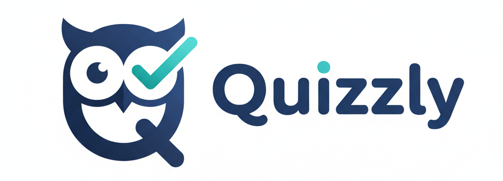
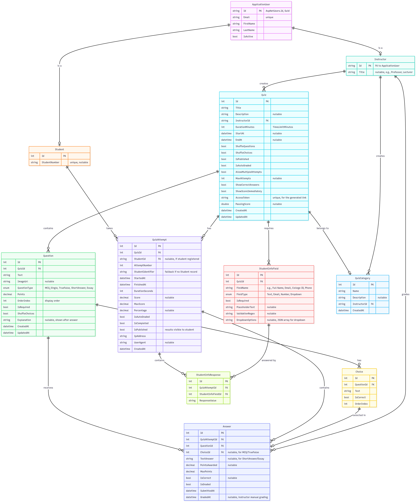
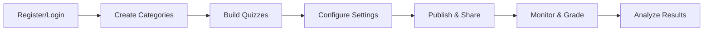
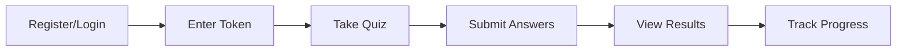

<div align="center">
  
  
  <h1>Quizzly - A Quickly Online Quiz Management System</h1>
  
  <p align="center">
      <a href="http://quizzly.runasp.net">
        
      </a>
  </p>
    
</div>

---

## 🎯 Overview

Quizzly is an online quiz management system built with **ASP.NET Core MVC** that revolutionizes the way instructors create, manage, and grade quizzes. With **AI-powered automated grading**, real-time analytics, and an intuitive interface, Quizzly makes online assessments simple, efficient, and intelligent.

### 🌟 Why Quizzly?

- 🤖 **AI-Powered Grading** - Automated grading with Groq AI for consistent and fast results
- 📊 **Advanced Analytics** - Comprehensive insights into student performance and question difficulty
- ⚡ **Real-Time Experience** - Instant feedback and live progress tracking
- 🎨 **Modern Interface** - Responsive design that works seamlessly on all devices
- 🔒 **Secure & Scalable** - Enterprise-grade security with role-based access control

---

## 🚀 Features

### 👨‍🏫 For Instructors

<details open>
<summary><strong>📝 Quiz Management</strong></summary>

- **Multiple Question Types**: MCQ, True/False, Short Answer, and Essay questions
- **Flexible Configuration**: Time limits, shuffle options, passing scores, and attempt limits
- **Smart Access Control**: Generate unique tokens for secure quiz distribution
- **Draft & Publish**: Control when quizzes become available to students
- **Rich Media Support**: Add images to questions using Cloudinary integration

</details>

<details>
<summary><strong>✅ Intelligent Grading System</strong></summary>

- **AI-Powered Automation**: Leverage Groq AI for consistent grading of subjective questions
- **Manual Grading**: grades subjective questions with a manual grading tool
- **Flexible Scoring**: Assign custom points per question
- **Detailed Analytics**: Track grading patterns and identify trends

</details>

<details>
<summary><strong>📈 Analytics & Reporting</strong></summary>

- **Performance Dashboard**: Real-time insights into student achievement
- **Question Analytics**: Identify challenging questions and common mistakes
- **Score Distribution**: Visual charts showing class performance
- **Time Tracking**: Monitor average completion times
- **Category Insights**: Performance breakdown by quiz categories

</details>

<details>
<summary><strong>👥 Student Management</strong></summary>

- **Progress Tracking**: Monitor individual student journeys
- **Grade History**: Complete records with timestamps and feedback
- **Performance Reports**: Comprehensive student analytics

</details>

### 🎓 For Students

<details open>
<summary><strong>📚 Quiz Taking Experience</strong></summary>

- **One-Click Access**: Join quizzes instantly with access tokens
- **Mobile Optimized**: Seamless experience on any device
- **Smart Navigation**: Easy movement between questions with progress indicators
- **Time Management**: Real-time countdown timer and progress tracking
- **Auto-Save**: Never lose your progress with automatic answer saving

</details>

<details>
<summary><strong>🎯 Results & Feedback</strong></summary>

- **Instant Results**: Immediate feedback for auto-graded questions
- **Detailed Explanations**: Comprehensive feedback and correct answers
- **History Tracking**: Access all previous attempts and grades
- **Performance Insights**: Track improvement over time with visual charts

</details>

### ⚙️ System Features

- 🔐 **Authentication**: Google OAuth + ASP.NET Identity
- 🤖 **AI Integration**: Groq AI API for intelligent grading
- 📧 **Email Notifications**: Automated alerts for grading updates
- ☁️ **Cloud Storage**: Cloudinary for image and file management
- 🎨 **Responsive Design**: Bootstrap-powered modern UI

---

## 🛠️ Technology Stack

<div align="center">
  <table>
  <tr>
    <td width="50%" valign="top">
    
  ### Backend
  - **.NET 9.0** - Latest framework
  - **ASP.NET Core MVC** - Web framework
  - **Entity Framework Core 9.0** - ORM
  - **SQL Server** - Database
  - **ASP.NET Identity** - Authentication
  
  </td>
  <td width="50%" valign="top">
  
  ### Frontend
  - **Bootstrap 5** - UI framework
  - **JavaScript (ES6+)** - Interactivity
  - **CSS3** - Modern styling
  - **Razor Views** - Server-side rendering
  
  </td>
  </tr>
  <tr>
  <td width="50%" valign="top">
  
  ### AI & Cloud Services
  - **Groq AI API** - Automated grading
  - **Cloudinary** - Image storage
  - **SMTP/MailKit** - Email service
  - **Google OAuth 2.0** - Authentication
  
  </td>
  
  <td width="50%" valign="top">
  
### Architecture & Patterns
- **Repository Pattern & Unit Of Work** - Clean data access layer
- **Dependency Injection** - Built-in IoC container
- **MVC Architecture** - Separation of concerns
- **Entity Framework Migrations** - Database versioning

</td>

</tr>
</table>
</div>

---

## 📊 Database Architecture

<div align="center">
  
  <p><em>Comprehensive database schema supporting all quiz and user management features</em></p>
</div>

---

## 🏗️ Project Structure

```
Quizzly/
├── 🌐 Quizzly.Web/                 # Web application layer
│   ├── Areas/                       # MVC Areas for different user types
│   │   ├── Authentication/          # Login/Registration functionality
│   │   ├── Instructor/              # Instructor-specific features
│   │   └── Student/                 # Student-specific features
│   ├── Controllers/                 # Main application controllers
│   ├── Views/                       # Shared views and layouts
│   └── wwwroot/                     # Static files (CSS, JS, images)
│
├── 💼 Quizzly.Business/             # Business logic layer
│   ├── Services/                    # Service implementations
│   │   ├── Implementations/         # Concrete service implementations
│   │   └── Interfaces/              # Service contracts
│   ├── ViewModels/                  # Data transfer objects
│   └── Configuration/               # Application configuration
│
├── 🗄️ Quizzly.DataAccess/          # Data access layer
│   ├── Entities/                    # Domain entities
│   ├── Repositories/                # Repository pattern implementation
│   ├── Data/                        # DbContext and configurations
│   └── Migrations/                  # Entity Framework migrations
│
└── 📚 docs/                         # Documentation and diagrams
```

---

## 📱 Usage Guide

### 👨‍🏫 For Instructors



1. **Register/Login** - Create an instructor account or sign in
2. **Create Categories** - Organize quizzes by subject or topic
3. **Build Quizzes** - Add questions with various types and media
4. **Configure Settings** - Set time limits, scoring, and access options
5. **Publish & Share** - Generate access tokens and distribute to students
6. **Monitor & Grade** - Track progress and grade manual questions
7. **Analyze Results** - View comprehensive analytics and insights

### 🎓 For Students



1. **Register/Login** - Create a student account or sign in
2. **Enter Token** - Use the access code provided by your instructor
3. **Take Quiz** - Answer questions within the time limit
4. **Submit Answers** - Review and submit your responses
5. **View Results** - See scores and detailed feedback
6. **Track Progress** - Access your complete quiz history

---

<div align="center">

## 💡 Getting Started

Want to try Quizzly? Visit our **[Live Demo](http://quizzly.runasp.net)** to experience the platform firsthand!

---

### 🌟 Star Us!

If you find Quizzly helpful, please consider giving us a star ⭐

---


**Quizzly** - Make taking online quizzes more **quickly** ✨😉


---

*© 2025 Quizzly Team. All rights reserved.*

</div>
